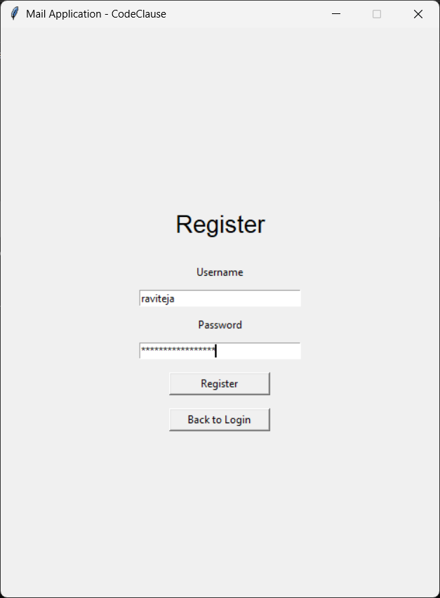
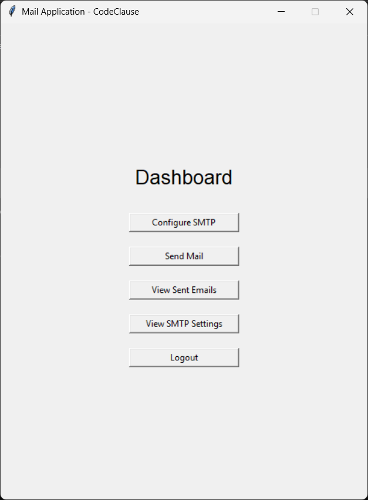
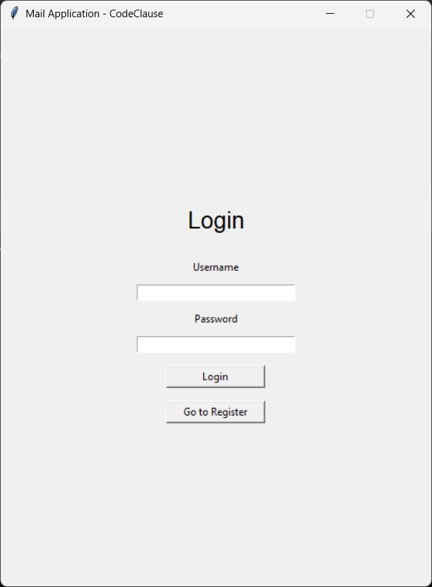

# 🚀 CodeClause Python Internship Tasks

## 📧 Task: Mail Application with UI ⭐ Golden Project

### 📌 Description
- A Python-based **Mail Application with Graphical User Interface**
- Allows users to:
  - Register and authenticate users  
  - Send emails securely  
  - Manage email operations through a UI  
- Uses a **database-backed system** for storing user and mail data  
- Implements modular architecture for better scalability  

## 📂 Project Files
Make sure the following files are present in the project directory:

```text
mail_app.py
auth.py
database.py
mailer.py
app.db
```
## ⚙️ Technologies Used

- **Python**
- **Tkinter** (for UI)
- **SQLite** (Database)
- **SMTP** (Email sending)

## 📦 Required Libraries

Install the required Python libraries before running the project:

```bash
pip install secure-smtplib
```
## ⚠️ Note

Standard libraries like `sqlite3`, `smtplib`, and `tkinter` come pre-installed with Python.

## ▶️ How to Run

1. Open **Command Prompt** / **Terminal**
2. Navigate to the project directory
3. Run the following command:

```bash
python mail_app.py
```
4. The Mail Application UI will launch
5. Register or log in to start sending emails

## 📸 Screenshots

### 🔹 Login Screen
<p align="center">
  
</p>

### 🔹 Register Screen
<p align="center">
  
</p>

### 🔹 Dashboard
<p align="center">
  
</p>

### 🔹 SMTP Settings
<p align="center">
  
</p>

### 🔹 Send Mail
<p align="center">
  
</p>

### 🔹 Sent Emails
<p align="center">
  
</p>

### 🔹 View SMTP Settings
<p align="center">
  
</p>

### 🔹 Logout
<p align="center">
  
</p>

